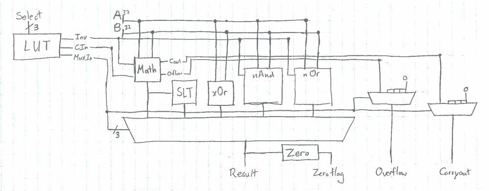

#1 Lab 1 Results
##### Patrick Huston, Nur Shlapobersky, Kai Levy

### Implementation

In the process of implementing our ALU, we made several interesting design choices to improve efficiency, speed, and decrease the area of the unit.

- Our LUTcontrol module takes in a 3-bit selector value and outputs 3 wires: an inverse, carryin, and muxIndex.
- Our AND and NAND gates are defined by the same module. We use the 'inverse' input that is determined by our 'LUTcontrol' to control which of the two operations we perform.
- Our OR and NOR gates operate with the same structure.
- Our addition, subtraction, and part of simple-less-than operations are all implemented by a 'Math' module
	- Inverse is 1 for subtraction and simple-less-than
	- Carryin is 1 for subtraction
- Our simple-less-than takes the output of our math module and then checks whether the most significant bit is zero.

### Test Results

- AND, NAND Test Bench Results

- OR, NOR Test Bench Results

- ADD, SUB Test Bench Results

- SLT Test Bench Results

###### ADD
For our addition, we decided that we should test at least two cases for both the carryout flag and overflow flag: Two 'Simple addition' which set neither flag. Two 'Carryout' tests which set the only the carryout-- which would happen when adding something to a negative number such that it would add to the most significant bit, but remain negative. Two 'Overflow' cases, which set only the overflow-- a case that resulted in adding two large positive number, such that the output would overflow into negative numbers. Finally, two 'Carryout and Overflow' cases, which set both carryout and overflow, by adding two largely negative numbers such that the result would have a carryout and overflow into positive numbers.

###### SUB
The subtraction tests were chosen to the same guidelines as the addition ones. Because subtraction is equivalent to addition, but with a negative second operand, the tests were basically the same as addition, but with the 'b' value set to a negative number on the same magnitude.

###### XOR
The XOR module is relatively simple: a series of 32 XORs on each bit. Because of this, we know that if one bit works, the rest should work. As a result, our testing was composed of one case that would activate the 0 flag, and two other cases that we could easily verify were correct

###### SLT

###### AND
The AND module simply built on the NAND module by running a bitwise NOT on the output. Because of this, we know that if one bit works, the rest should work. As a result, our testing was composed of one case that would activate the 0 flag, and two other cases that we could easily verify were correct

###### NAND
The NAND module is relatively simple: a series of 32 NANDs on each bit. Because of this, we know that if one bit works, the rest should work. As a result, our testing was composed of one case that would activate the 0 flag, and two other cases that we could easily verify were correct

###### NOR
The NOR module is relatively simple: a series of 32 NORs on each bit. Because of this, we know that if one bit works, the rest should work. As a result, our testing was composed of one case that would activate the 0 flag, and two other cases that we could easily verify were correct

###### OR
The OR module simply built on the NOR module by running a bitwise NOT on the output. Because of this, we know that if one bit works, the rest should work. As a result, our testing was composed of one case that would activate the 0 flag, and two other cases that we could easily verify were correct

###### Flaws
We found a significant error due to our testing which had to do with the timing of our ALU. The always block (line 40) was only set to be activated when the selector changed, so it did not work when we tested multiple cases of the same function. When we added it to change when selector OR a OR b changed, we found that the always block would be activated before the results had a chance to be computed, and our results were offset one later than they should have been. In order to work around that, we had to implement a delay, of more than our longest possible operation, that would take effect whenever the always block was activated.

### Timing Analysis

###### AND and NAND
Bitwise AND and NAND have the same delay since they are outputted from the same module:
- First there are 32 NAND gates for a delay of 32*10 = 320
- Then there are 32 XOR gates for a delay of 32*10 = 320, for a total delay of __640__.

###### OR and NOR
Bitwise OR and NOR have the same delay since they are outputted from the same module:
- First there are 32 NOR gates for a delay of 32*10 = 320
- Then there are 32 XOR gates for a delay of 32*10 = 320, for a total delay of __640__.

###### XOR
Bitwise Xor is simply 32 XOR gates for a total delay of 32*10 = __320__.

###### ADD, SUB, SLT
These three gates have the same delay since they are outputted from the same module:
- First we XOR our B input with our sign-extended inverse input, for a delay of 32*10 = 320
- A single-bit adder's maximum delay is through a XOR, AND, and OR gate, for a delay of (10+20+20)*32 = 1600
- The overflow check is one XOR gate for a delay of 10, bringing the total to __1930__

###### Zero Flag
The zero flag check is a 32-bitwise NOR gate, for a total delay of 32*10 = __320__.

Thus the largest delay of our ALU is an addition, subtraction, or simple-less than, which then passes through the zero flag,for a total delay of **2250**.

### Work Plan Relection

Our finalized work-plan:

Task      | Time Estimate | Date of Completion
---|---|---
Design ALU operations AND NAND OR NOR XOR on whiteboard          |   0h30m       |     10.7.15
Design ALU operations ADD SUB SLT         on whiteboard          |   1h30m       |     10.9.15
Design test bench for each ALU operation                          |   1h30m       |     10.9.15
Write verilog code for ALU                                        |   2h00m       |     10.9.15
Analyze timing for ALU                                            |   1h00m       |     10.10.15
Create 'Implementation' writeup section                           |   1h00m       |     10.10.15
Create 'Test Results' writeup section                             |   1h00m       |     10.11.15
Create 'Timing Analysis' writeup section                          |   1h00m       |     10.11.15
Review work plan reflection                                       |   0h40m       |     10.12.15

The actual time it took us to complete the tasks:

Task  |     Time Spent
---|---
Construct ADD SUB SLT           |  2h30m
Construct AND NAND OR NOR XOR   |  0h20m
Construct ALU LUT			    |  1h00m
Construct top level ALU module  |  1h00m
Construct Test Bench, and debug |  3h00m
Analyze Worst Propagation Delay |  0h15m
Create writeup.md               |  1h30m

We planned on spending a total of 10h40m on this lab, and we actually spent 9h35m.
Designing our ALU went fairly smoothly, but we made the mistake of translating it all into verilog at once, and not testing incrementally.
As a result, we spent the largest section of our time debugging as we created our test bench.

TODO:

	- Write test benches
		> AND, NAND
		> OR, NOR, XOR
		> ADD, SUB
		> SLT
